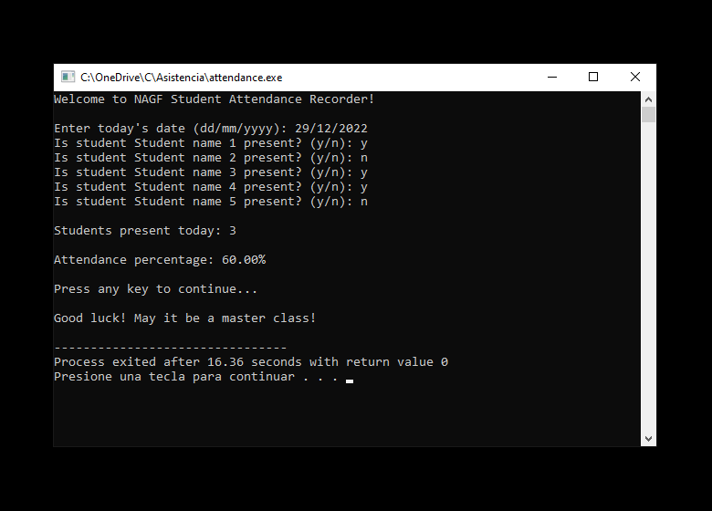

# NAGF Student Attendance Recorder

Simple C script that allows the user to record student attendance for a class and saves it to a .txt file.

A tool designed for programming teachers. If you teach C programming and want to impress your students, give it a try!

The repository includes:
* Source code of the software in C.
* Screenshots of the software running on Windows 10.
