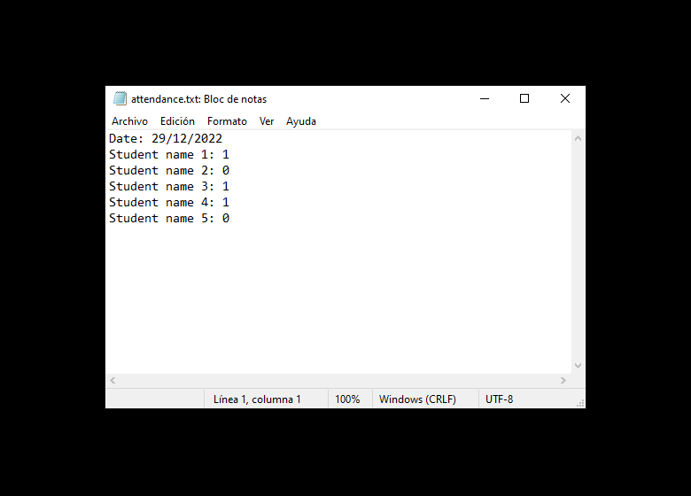

# NAGF Student Attendance Recorder

Simple C script that allows the user to record student attendance for a class.

It prompts the user to enter the current date, and then asks if each student is present or absent. It stores the attendance information in a file called "attendance.txt", and appends the new attendance data to the end of the file.

A tool designed for programming teachers. If you teach C programming and want to impress your students, give it a try!

The repository includes:
* Source code of the software in C language.
* Screenshots of the software running on Windows 10.
